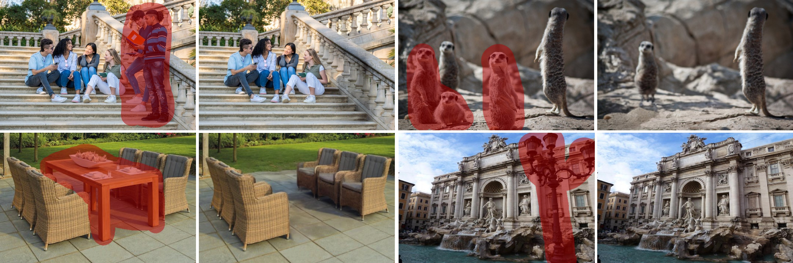

# SmartEraser: Remove Anything from Images using Masked-Region Guidance (CVPR 2025)

[Longtao Jiang*](https://longtaojiang.github.io/), [Zhendong Wang*](https://zhendongwang6.github.io/), [Jianmin Bao*†❤](https://jianminbao.github.io/), [Wengang Zhou†](http://staff.ustc.edu.cn/~zhwg/), [Dongdong Chen](https://www.dongdongchen.bid/), [Lei Shi](), [Dong Chen](http://www.dongchen.pro/), [Houqiang Li](http://staff.ustc.edu.cn/~lihq/en/),

(* Equal contribution, † Corresponding author, ❤ Project leader)

Project Page: [https://longtaojiang.github.io/smarteraser.github.io/](https://longtaojiang.github.io/smarteraser.github.io/)

Arxiv: [https://arxiv.org/abs/2501.08279](https://arxiv.org/abs/2501.08279)

**Your star means a lot for us to develop this project!** :star:

SmartEraser is a object removal model built on the novel Masked-Region Guidance paradigm. SmartEraser outperforms existing methods by smartly identifying the target object to remove while effectively preserving the surrounding context. To facilitate research on this paradigm, we propose Syn4Removal, a large-scale, high-quality dataset containing over a million image triplets, specifically designed for object removal tasks. Through extensive experiments, we demonstrate that SmartEraser achieves superior performance in both quality and robustness compared to previous object removal methods.

## News

- [2025/06/27] :fire: Release code, dataset pipeline and pre-trained models. [[BaiduDrive]()]
- [2025/02/26] :tada: SmartEraser is accepted by CVPR 2025.
- [2024/12/16] :sparkles: Release [paper](https://arxiv.org/abs/2501.08279).

## TODO

- [ ] Release Training and inference codes.
- [ ] Release SmartEraser pretrain models.
- [ ] Release dataset synthesis pipeline & synthesis process of Syn4Removal-1M.
- [ ] Release evaluation benchmarks of RORD-Val, DEFACTO-Val, and Syn4Removal-Val.

## Abstract
> Object removal has so far been dominated by "the mask-and-inpaint" paradigm, where the masked region is excluded from the input, leaving models relying on unmasked areas to inpaint the missing region. However, this approach lacks contextual information for the masked area, often resulting in unstable performance. In this work, we introduce SmartEraser, built with a new "removing" paradigm called Masked-Region Guidance. This paradigm retains the masked region in the input, using it as guidance for the removal process. It offers several distinct advantages: (a) it guides the model to accurately identify the object to be removed, preventing its regeneration in the output; (b) since the user mask often extends beyond the object itself, it aids in preserving the surrounding context in the final result. Leveraging this new paradigm, we present Syn4Removal, a large-scale object removal dataset, where instance segmentation data is used to copy and paste objects onto images as removal targets, with the original images serving as ground truths. Experimental results demonstrate that SmartEraser significantly outperforms existing methods, achieving superior performance in object removal, especially in complex scenes with intricate compositions.

<p align="center">

</p>

## 📍 Citation 

```
@misc{jiang2025smarteraserremoveimagesusing,
      title={SmartEraser: Remove Anything from Images using Masked-Region Guidance}, 
      author={Longtao Jiang and Zhendong Wang and Jianmin Bao and Wengang Zhou and Dongdong Chen and Lei Shi and Dong Chen and Houqiang Li},
      year={2025},
      eprint={2501.08279},
      archivePrefix={arXiv},
      primaryClass={cs.CV},
      url={https://arxiv.org/abs/2501.08279}, 
}
``` 

## 💗 Acknowledgements

This repository borrows heavily from [X-Paste](https://github.com/yoctta/XPaste) and [diffusers](https://github.com/huggingface/diffusers). Thanks to the authors for sharing their code and models.

## 🧿 Maintenance

This is the codebase for our research work. We are still working hard to update this repo, and more details are coming in days. If you have any questions or ideas to discuss, feel free to contact [Longtao Jiang](taotao707@mail.ustc.edu.cn) or [Zhendong Wang](zhendongwang6@outlook.com).

