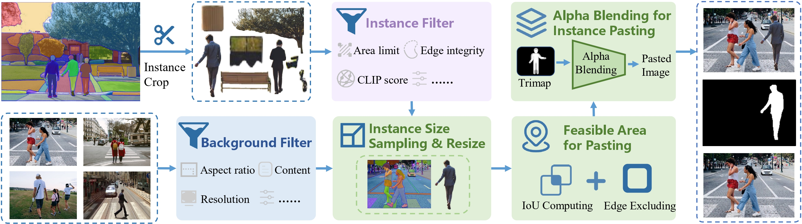
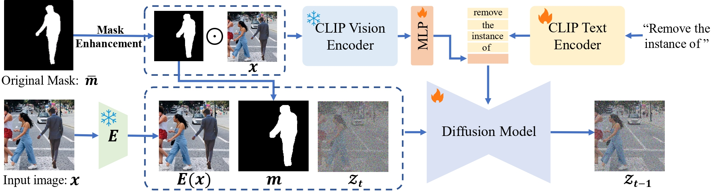

# SmartEraser: Remove Anything from Images using Masked-Region Guidance (CVPR 2025)

[Longtao Jiang*](https://longtaojiang.github.io/), [Zhendong Wang*](https://zhendongwang6.github.io/), [Jianmin Bao*†❤](https://jianminbao.github.io/), [Wengang Zhou†](http://staff.ustc.edu.cn/~zhwg/), [Dongdong Chen](https://www.dongdongchen.bid/), [Lei Shi](), [Dong Chen](http://www.dongchen.pro/), [Houqiang Li](http://staff.ustc.edu.cn/~lihq/en/),

(* Equal contribution, † Corresponding author, ❤ Project leader)

Project Page: [https://longtaojiang.github.io/smarteraser.github.io/](https://longtaojiang.github.io/smarteraser.github.io/)

Arxiv: [https://arxiv.org/abs/2501.08279](https://arxiv.org/abs/2501.08279)

**Your star means a lot for us to develop this project!** :star:

SmartEraser is a object removal model built on the novel Masked-Region Guidance paradigm. SmartEraser outperforms existing methods by smartly identifying the target object to remove while effectively preserving the surrounding context. To facilitate research on this paradigm, we propose Syn4Removal, a large-scale, high-quality dataset containing over a million image triplets, specifically designed for object removal tasks. Through extensive experiments, we demonstrate that SmartEraser achieves superior performance in both quality and robustness compared to previous object removal methods.

## News

- [2025/06/27] :fire: Release code, dataset pipeline and pre-trained models. [[BaiduDrive (password: smer)](https://pan.baidu.com/s/103shQ4HyVTk7_CsWywr_jA)] & [[GoogleDrive](https://drive.google.com/file/d/1D49l9DM6X_s34ISDk0J853z1VdiBzs2N/view?usp=drive_link)]
- [2025/06/27] :fire: Release evaluation benchmarks of RORD-Val, DEFACTO-Val, and Syn4Removal-Val. [[BaiduDrive (password: smer)](https://pan.baidu.com/s/1T2jbx2u9y5UQP7HSAa8ZQg)]
- [2025/02/26] :tada: SmartEraser is accepted by CVPR 2025.
- [2024/12/16] :sparkles: Release [paper](https://arxiv.org/abs/2501.08279).

## TODO

- [x] Release Training and inference codes.
- [x] Release SmartEraser pretrained models.
- [x] Release dataset synthesis pipeline & synthesis process of Syn4Removal-1M.
- [x] Release evaluation benchmarks of RORD-Val, DEFACTO-Val, and Syn4Removal-Val.

## Abstract
> Object removal has so far been dominated by "the mask-and-inpaint" paradigm, where the masked region is excluded from the input, leaving models relying on unmasked areas to inpaint the missing region. However, this approach lacks contextual information for the masked area, often resulting in unstable performance. In this work, we introduce SmartEraser, built with a new "removing" paradigm called Masked-Region Guidance. This paradigm retains the masked region in the input, using it as guidance for the removal process. It offers several distinct advantages: (a) it guides the model to accurately identify the object to be removed, preventing its regeneration in the output; (b) since the user mask often extends beyond the object itself, it aids in preserving the surrounding context in the final result. Leveraging this new paradigm, we present Syn4Removal, a large-scale object removal dataset, where instance segmentation data is used to copy and paste objects onto images as removal targets, with the original images serving as ground truths. Experimental results demonstrate that SmartEraser significantly outperforms existing methods, achieving superior performance in object removal, especially in complex scenes with intricate compositions.

<p align="center">

</p>

## Syn4Removal Pipeline
<p align="center">

</p>

## SmartEraser Framework
<p align="center">

</p>

## Requirements
```
conda create -n smarteraser python=3.10
conda activate smarteraser
pip install torch==2.1.0+cu121 torchvision==0.16.0+cu121 -f https://download.pytorch.org/whl/torch_stable.html
pip install -r requirements.txt
```

## Syn4Removal Dataset Pipeline
Due to copyright restrictions on the images in the Open-Image-v7, SAM, and COCONut datasets and huge storage usage, we are unable to provide direct downloads of the Syn4Removal dataset. 

However, as an alternative, we will provide a detailed demonstration of the synthesis process and corresponding code for the dataset.

Before synthesizing the data, please download the Open-Image-v7 dataset from the official website [Open-Image-v7](https://storage.googleapis.com/openimages/web/download_v7.html) and organize it into the following format:
```
open-images-v7
└── train/val/test
    ├── data
    │   ├── img1.jpg
    │   ├── img2.jpg
    │   └── ...
    ├── labels
    │   ├── 0
    │   ├── 1
    │   └── ...
    └── metadata
        ├── oidv7-classes-segmentation.txt
        ├── all_classes_id.csv
        ├── train/val/test-annotations-object-segmentation.csv
        └── ...
```
Also, please download the SAM dataset and COCONut dataset from the official website [SAM](https://segment-anything.com/dataset/index.html) & [COCONut](https://github.com/bytedance/coconut_cvpr2024), then download the json files from [[BaiduDrive (password:smer)](https://pan.baidu.com/s/1NVUPqfXAXN5Puh5NQtbamw)] and organize them into the following format:
```
SAM_COCONut_images
├── train_paste
│   ├── sam_1400k
│   │   ├── img1.jpg
│   │   ├── img2.jpg
│   │   └── ...
│   └── coconut-b
│       ├── img1.jpg
│       ├── img2.jpg
│       └── ...
└── annotations_bbox
    ├── coconut_b_bbox.json
    ├── sam_bbox_1420k_0.json
    ├── sam_bbox_1420k_1.json
    └── ...
```
First, download the [ViT-L-14.pt](https://openaipublic.azureedge.net/clip/models/b8cca3fd41ae0c99ba7e8951adf17d267cdb84cd88be6f7c2e0eca1737a03836/ViT-L-14.pt) weights and place them under `Dataset_pipeline/ckpts/`. Then, run `Dataset_pipeline/First_ded_instances_labels.by`. In this step, we crop instances from the Open-Image-v7 dataset and record some key information.
```
cd Dataset_pipeline
python First_seg_instances_labels.py --input_dir /path/to/open-images-v7/ --output_dir /path/to/open-images-v7-instance/ --clip_path ./ckpts/ViT-L-14.pt
```
Second, run `Dataset_pipeline/Second_instances_filter.by` to filter instances based on clip score, area and other factors to obtain high-quality instances.
```
cd Dataset_pipeline
python Second_instances_filter.py --input_dir /path/to/open-images-v7-instance --output_dir /path/to/open-images-v7-instance-filter-1000k/
```
Third, run `Dataset_pipeline/Third_sam_coco_paste.by` to paste the filtered instance onto the background image, area and other factors to obtain high-quality instances. In this process, we first resize the instance based on the background image and the size of the instance class. Then, we determine the feasible area by calculating IoU and other factors. Finally, we seamlessly blend the two using alpha blending.
```
cd Dataset_pipeline
python Third_sam_coco_paste.py --paste_dir /path/to/SAM_COCONut_images --instance_dir /path/to/open-images-v7-instance-filter-1000k --output_dir /path/to/SAM_COCONut_paste
```
Finally, we obtained the Syn4Removal, a large-scale, high-quality dataset containing over a million image triplets, specifically designed for object removal tasks.

## Training
Before training, please download the weights from [stable-diffusion-v1-5-inpainting](https://huggingface.co/stable-diffusion-v1-5/stable-diffusion-inpainting) and [clip-vit-large-patch14](https://huggingface.co/openai/clip-vit-large-patch14), and place them in the `Model_framework/ckpts` as pre training weights. Then point the `--datadir` parameter to the `/path/to/SAM-COCONut_maste` folder to use the Syn4Removal dataset for training. To compensate for object shadows gaps between synthetic data and real data, we also recommend mixing a small amount of RORD trainset data, such as 30k. Finally, you can train the SmartEraser model by running the following command:
```
cd Model_framework
bash train_region_inpaint.sh
```
## Inference
We provide the pre-trained SmartEraser model in [[BaiduDrive (password: smer)](https://pan.baidu.com/s/103shQ4HyVTk7_CsWywr_jA)].
You should place all weight folders and files under the folder `Model_framework/ckpts/smarteraser-weights`, then you can evaluate the SmartEraser model by running the following command:
```
cd Model_framework
bash inference_dis.sh
```
## Local Demo
We also provide a inference demo `app_remove.sh`. Also, You should place all weight folders and files under the folder `Model_framework/ckpts/smarteraser-weights`, then tou can run the following command to inference a single image with a hand-drawn mask:
```
cd Model_framework
bash app_remove.sh
```
## 📍 Citation 

```
@misc{jiang2025smarteraserremoveimagesusing,
      title={SmartEraser: Remove Anything from Images using Masked-Region Guidance}, 
      author={Longtao Jiang and Zhendong Wang and Jianmin Bao and Wengang Zhou and Dongdong Chen and Lei Shi and Dong Chen and Houqiang Li},
      year={2025},
      eprint={2501.08279},
      archivePrefix={arXiv},
      primaryClass={cs.CV},
      url={https://arxiv.org/abs/2501.08279}, 
}
``` 

## 💗 Acknowledgements

This repository borrows heavily from [X-Paste](https://github.com/yoctta/XPaste) and [diffusers](https://github.com/huggingface/diffusers). Thanks to the authors for sharing their code and models.

## 🧿 Maintenance

This is the codebase for our research work. We are still working hard to update this repo, and more details are coming in days. If you have any questions or ideas to discuss, feel free to contact [Longtao Jiang](taotao707@mail.ustc.edu.cn) or [Zhendong Wang](zhendongwang6@outlook.com).

